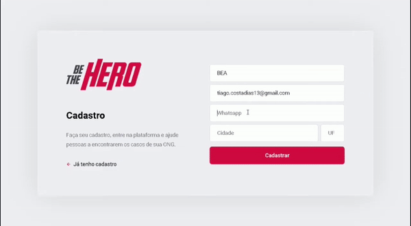

<h1 align="center">
 
  
 
 
BE THE HERO
</h1>

Aplicação para conectar ONGs e outras instituições a pessoas que tem disponibilidade para ajudar

  

[//]: # (Add your gifs/images here:)

  

## Introdução
A 11ª edição da Semana OmniStack, ocorrida entre 23/03 e 27/03, trouxe como projeto uma aplicação web. Um sistema para conectar pessoas dispostas a ajudar a ONGs que precisam dessa ajuda.

Em uma semana foi desenvolvida uma aplicação do zero, dominando o backend e frontend com uma única linguagem e uma única biblioteca de interfaces.
## Recursos
[//]: # (Add the features of your project here:)
Essa foi uma aplicação full stack em Javascript
- ⚛️ **React Js** — É uma biblioteca JavaScript de código aberto com foco em criar interfaces de usuário em páginas web.
- 💹 **Node Js** — É um interpretador de JavaScript assíncrono com código aberto orientado a eventos.

## Como Instalar

Execute `npm install` nas pastas backend, frontend e mobile, para instalar as dependências.

Rode `npm start` nas pastas backend e frontend para utilizar a versão web. Acesse via localhost:3000.

## License

This project is licensed under the MIT License - see the [LICENSE](https://opensource.org/licenses/MIT) page for details.